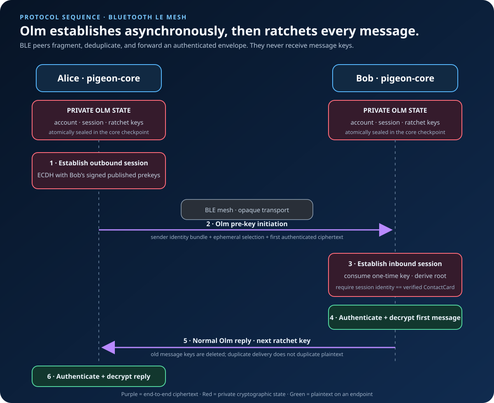
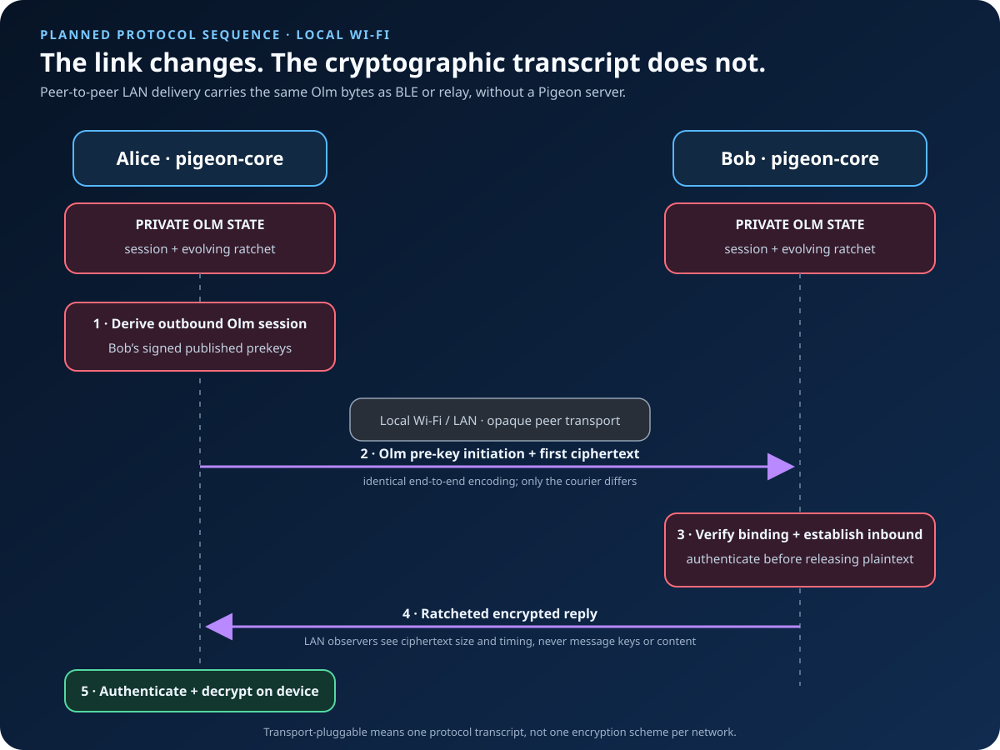
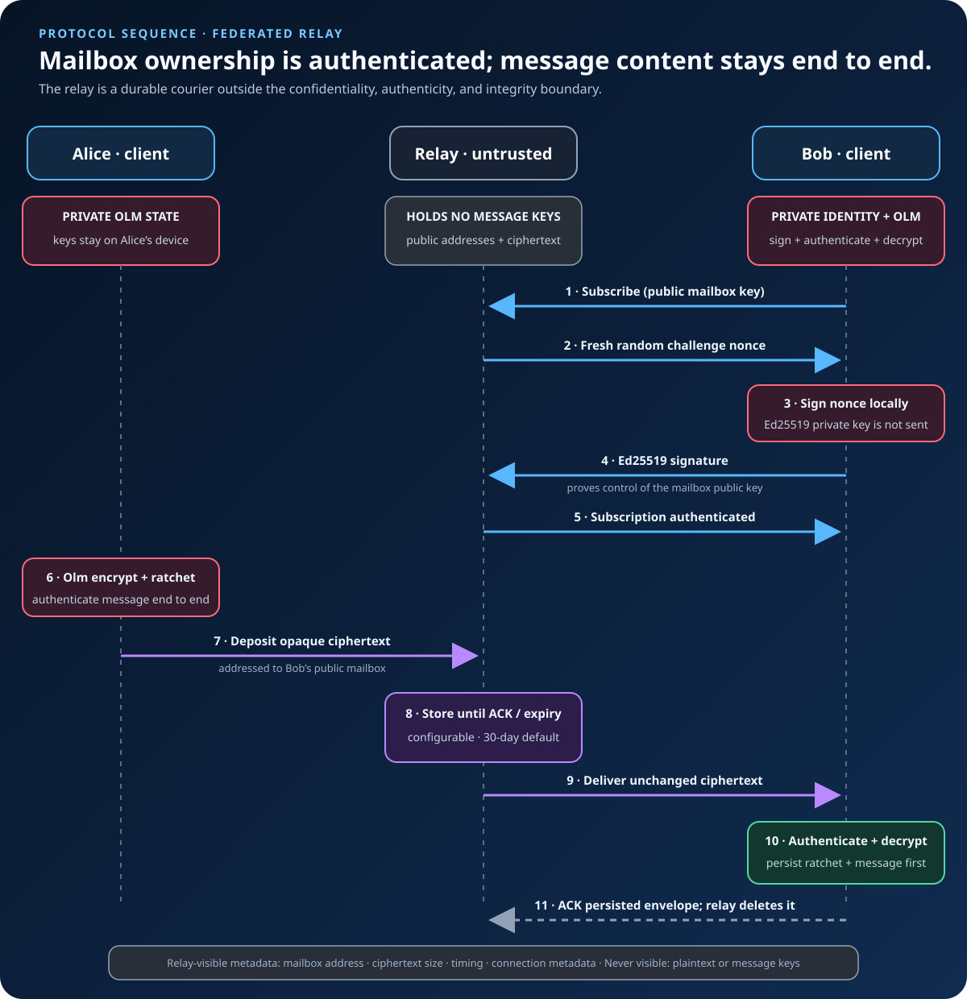
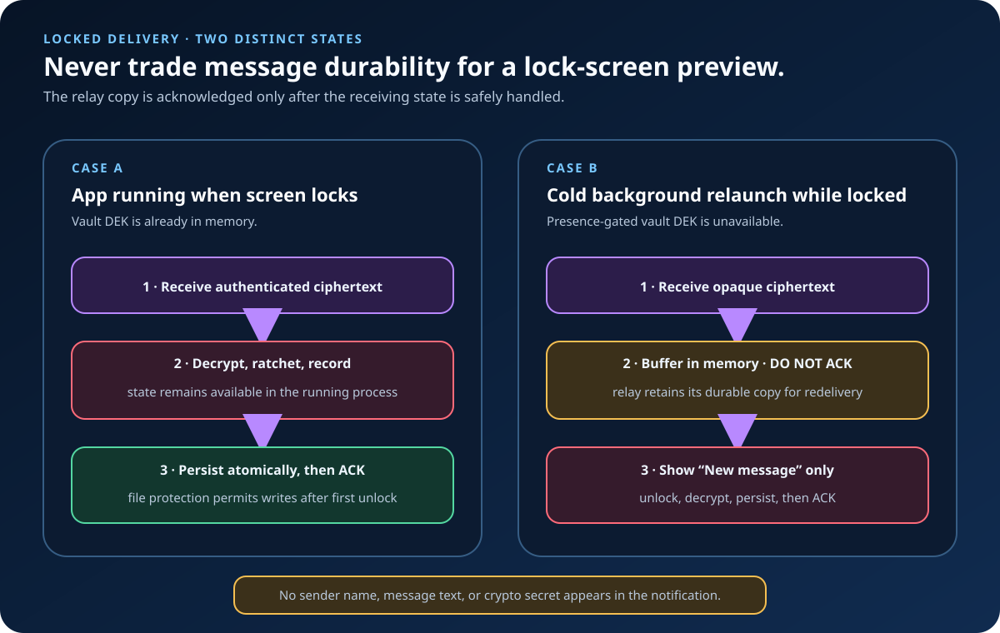
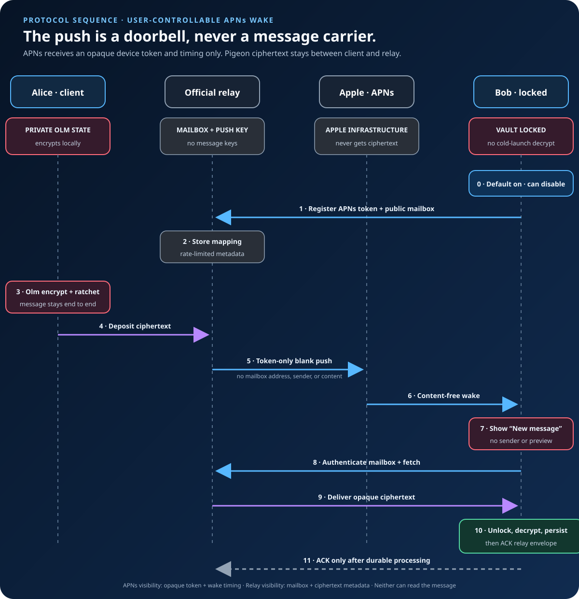

# Delivery and privacy

[How Pigeon Works](HOW_IT_WORKS.md) covers keys, trust, sessions, and groups.

## Step 5 — The couriers (transports)

Everything above produces **ciphertext** — the locked box. It then travels over
whatever connection is available; multiple transports can run at once, and none
can read the box.

### Bluetooth LE mesh — when you're nearby

*An Olm session opened from published prekeys and an encrypted message over
Bluetooth — no server.*

In range, two phones talk directly with no internet or account. If a peer is just
out of range, nearby Pigeon devices forward the still-locked box onward — a
**mesh**. Each hop sees only ciphertext (plus a small amount of routing
metadata). This works on a plane, at a protest, during an outage — anywhere the
internet is absent or untrusted.

### Local Wi-Fi — same lock, more bandwidth

*Identical end-to-end crypto to Bluetooth; only the link layer changes.*

Devices on the same network can use this transport. The diagram is deliberately
the *same* as Bluetooth apart from the courier. The LAN carries only ciphertext.

### Relay — when you're far apart *(zero-knowledge)*

*A blind mailbox: it stores opaque ciphertext addressed by public key and never
sees content or private keys.*

Two phones on different networks (e.g. both on cellular) usually can't connect
directly: behind NAT, a phone can dial out but not be dialed in. They need a
mutually reachable rendezvous on the internet. Pigeon's is a **relay** — a
deliberately dumb, **zero-knowledge** mailbox. What makes trusting it unnecessary:

- **Your mailbox address is just your public key.** To *read* it you prove
  ownership via **challenge–response**: the relay sends a random nonce, you sign it
  with your Ed25519 **private** key (which never leaves the phone), and the relay
  verifies the signature against your public key. The relay only ever learns
  *public* keys.
- Anyone can **drop off** a locked box for your mailbox; the relay **stores and
  forwards** it (up to 30 days) until you fetch it, then deletes it once your phone
  acknowledges receipt.
- The relay **never** sees plaintext, holds no keys, and cannot forge a message
  (integrity/authenticity are guaranteed end-to-end by the Olm session's message
  authentication). See its gray badge: *"Holds no keys."*

What a relay *can* observe is **metadata** — that some ciphertext was deposited for
some public key, its size, and timing. That's not nothing, which is why relays are
**on by default, user-controllable** and **federated**: anyone can run one, you choose which, and you can
self-host. Reducing this metadata further (padding, sealed-sender addressing,
optional Tor) is on the [Roadmap](ROADMAP.md).

---

## Step 6 — Notifications without leaking

A locked phone is the hard case. To *decrypt*, Pigeon must open its on-device
message store, which is sealed behind Face ID / your passcode — and you can't do
Face ID while the phone is asleep in your pocket. The design threads this needle.

### Today: notify now, decrypt at unlock

*A running app persists normally through screen lock; a cold background relaunch
buffers ciphertext without acknowledging it until the vault can open.*

1. If Pigeon was already running when the screen locked, its vault key remains in
   memory. It decrypts, records, and atomically persists normally using a file
   protection class writable after the first unlock since boot ([Apple Platform
   Security][appsec]). Only then does it acknowledge the relay.
2. If iOS cold-launches Pigeon in the background while locked, the presence-gated
   vault key is unavailable. Pigeon holds the locked box in memory and posts a
   **content-free** alert — just "New message," no sender, no preview. It
   deliberately does *not* acknowledge the relay, which retains the durable copy
   for redelivery.
3. On unlock, the vault opens; Pigeon decrypts and persists the buffered box, then
   acknowledges it.

> Even the notification reveals nothing about who messaged you or what they said —
> a deliberate lock-screen privacy choice.

### Push wake-ups via APNs

*A content-free push wakes the phone; the message itself never travels through
Apple.*

iOS eventually suspends a backgrounded app, so for reliable delivery hours later,
Pigeon can use Apple Push Notification service (**APNs**,
[Apple developer docs][apns]) purely as a doorbell:

- Push wake-ups are **on by default and can be turned off**. When enabled, your
  phone registers an opaque APNs token with Pigeon's **official** relay. (Only
  the app's publisher can push to the app, so this part can't be federated — it
  lives on the official relay only.)
- When a box arrives, the relay asks APNs to send a **content-free** wake-up. Your
  phone wakes, fetches the locked box, and — as before — only decrypts after you
  unlock.
- Apple and the gateway see a **token, timing, and a blank wake** — never your
  message (APNs's gray badge: *"never content"*).

This trades a little "someone pinged this device" metadata for reliable
notifications, strictly opt-in. Confidentiality remains end-to-end.

---

## What an attacker can and can't do

**A snoop on the wire, a malicious or hacked relay, or your phone company *cannot*:**

- read your messages — they only ever hold authenticated ciphertext (AES-256 with
  HMAC-SHA256, [Bellare & Namprempre 2000][etm]);
- impersonate a contact you verified in person — the safety number + binding check
  expose a substituted key;
- recover past messages from a key stolen later — the ratchet already deleted it
  (forward secrecy, [Cohn-Gordon et al. 2017][signalanalysis]).

**They *can* still learn some things — and Pigeon says so plainly:**

- A **relay** sees metadata (that ciphertext moved for some public key, its size,
  timing). Relay delivery is enabled by default and can be disabled in settings.
- Over **Bluetooth**, nearby devices can detect a Pigeon device's presence.
- If your phone is taken while **unlocked**, your messages are exposed — no app can
  protect an unlocked device in someone else's hand.

And the standing caveat: **Pigeon is pre-audit.** The building blocks (CryptoKit,
Olm via the audited `vodozemac`, the Double Ratchet) are well-studied, but
Pigeon's *assembly* of them — and its glue code — has not yet had an independent
security audit and must not be treated as proven-secure. See the
[Security Model](SECURITY_MODEL.md) and [Roadmap](ROADMAP.md).

---

## Where the secrets live

- Long-term and purpose-scoped **Ed25519 identity keys** live in the iPhone
  **Keychain**, marked *this-device-only*: never synced to iCloud or included in
  backups. An explicit move between two unlocked phones can transfer them over
  a locally authenticated, encrypted channel; the old phone then retires its
  identity before the new phone activates it. The root/relay identity uses
  `AfterFirstUnlock` when background delivery is enabled, or `WhenUnlocked` when
  disabled. MLS signing, group-capability, and recovery keys always use
  `WhenUnlocked`; a process that loaded them while unlocked may retain them in
  memory, but a cold locked launch cannot read them
  ([Apple Platform Security][appsec]).
- Evolving **Olm and MLS state** lives inside pigeon-core's atomic checkpoint.
  The checkpoint and message store are encrypted under a vault key sealed behind
  **Face ID / passcode**, so a cold background relaunch cannot open them while
  locked. A process that was already running retains the vault key in memory and
  can persist safely through screen lock.
- **No key is ever sent to any server.** Servers handle locked boxes only.

That's the whole system: exchange cards once and verify the safety number; agree
on a secret no one else can compute, even when the other person is offline (an
Olm session from published prekeys); authenticate who you're talking to (the
identity binding check); give every message its own disposable key (the Double
Ratchet); and let any courier carry the locked box, because none of them hold the
key to open it.

---

## References

Standards and specifications:

- **RFC 7748** — *Elliptic Curves for Security* (X25519 key
  agreement). <https://www.rfc-editor.org/rfc/rfc7748>
- **RFC 8032** — *Edwards-Curve Digital Signature Algorithm (EdDSA)* (Ed25519).
  <https://www.rfc-editor.org/rfc/rfc8032>
- **M. Bellare & C. Namprempre**, *Authenticated Encryption: Relations among
  Notions* (encrypt-then-MAC), ASIACRYPT 2000. <https://eprint.iacr.org/2000/025>
- **FIPS 197** — *Advanced Encryption Standard (AES)*.
  <https://csrc.nist.gov/pubs/fips/197/final>
- **NIST SP 800-38D** — *Galois/Counter Mode (GCM) and GMAC* (the at-rest AEAD).
  <https://csrc.nist.gov/pubs/sp/800/38/d/final>
- **RFC 5869** — *HMAC-based Key Derivation Function (HKDF)*.
  <https://www.rfc-editor.org/rfc/rfc5869>
- **FIPS 180-4** — *Secure Hash Standard* (SHA-256 / SHA-512).
  <https://csrc.nist.gov/pubs/fips/180-4/upd1/final>
- **Olm** — *Olm: A Cryptographic Ratchet* (the session protocol Pigeon uses).
  <https://gitlab.matrix.org/matrix-org/olm/-/blob/master/docs/olm.md>
- **vodozemac** — audited Rust implementation of Olm/Megolm.
  <https://github.com/matrix-org/vodozemac>
- **The Double Ratchet Algorithm** — Trevor Perrin & Moxie Marlinspike, 2016.
  <https://signal.org/docs/specifications/doubleratchet/>
- **The X3DH Key Agreement Protocol** — Marlinspike & Perrin, 2016.
  <https://signal.org/docs/specifications/x3dh/>
- **Signal safety numbers** — Signal Support.
  <https://support.signal.org/hc/en-us/articles/360007060632>
- **Apple Platform Security** — Keychain data protection classes & APNs.
  <https://support.apple.com/guide/security/welcome/web>
- **Apple — Apple Push Notification service (APNs)**.
  <https://developer.apple.com/documentation/usernotifications>

Foundational papers:

- **W. Diffie & M. Hellman**, *New Directions in Cryptography*, IEEE Trans.
  Information Theory, 1976. <https://doi.org/10.1109/TIT.1976.1055638>
- **D. J. Bernstein**, *Curve25519: New Diffie-Hellman Speed Records*, PKC 2006.
  <https://cr.yp.to/ecdh.html>
- **D. J. Bernstein, N. Duif, T. Lange, P. Schwabe, B.-Y. Yang**, *High-speed
  high-security signatures* (Ed25519), 2012. <https://ed25519.cr.yp.to/>
- **P. Rogaway**, *Authenticated-Encryption with Associated-Data* (AEAD), CCS 2002.
  <https://web.cs.ucdavis.edu/~rogaway/papers/ad.html>
- **K. Cohn-Gordon, C. Cremers, B. Dowling, L. Garratt, D. Stebila**, *A Formal
  Security Analysis of the Signal Messaging Protocol*, EuroS&P 2017.
  <https://eprint.iacr.org/2016/1013>
- **K. Cohn-Gordon, C. Cremers, L. Garratt**, *On Post-Compromise Security*, IEEE
  CSF 2016. <https://eprint.iacr.org/2016/221>

*The diagrams are hand-maintained accessible SVGs. Their colors consistently
distinguish private state, public material, ciphertext, plaintext, and untrusted
infrastructure.*

[rfc7748]: https://www.rfc-editor.org/rfc/rfc7748
[rfc8032]: https://www.rfc-editor.org/rfc/rfc8032
[rfc9420]: https://www.rfc-editor.org/rfc/rfc9420
[rfc5869]: https://www.rfc-editor.org/rfc/rfc5869
[fips180]: https://csrc.nist.gov/pubs/fips/180-4/upd1/final
[fips197]: https://csrc.nist.gov/pubs/fips/197/final
[etm]: https://eprint.iacr.org/2000/025
[vodozemac]: https://github.com/matrix-org/vodozemac
[doubleratchet]: https://signal.org/docs/specifications/doubleratchet/
[x3dh]: https://signal.org/docs/specifications/x3dh/
[safetynum]: https://support.signal.org/hc/en-us/articles/360007060632
[appsec]: https://support.apple.com/guide/security/welcome/web
[apns]: https://developer.apple.com/documentation/usernotifications
[dh76]: https://doi.org/10.1109/TIT.1976.1055638
[curve25519]: https://cr.yp.to/ecdh.html
[ed25519]: https://ed25519.cr.yp.to/
[aead]: https://web.cs.ucdavis.edu/~rogaway/papers/ad.html
[signalanalysis]: https://eprint.iacr.org/2016/1013
[pcs]: https://eprint.iacr.org/2016/221
