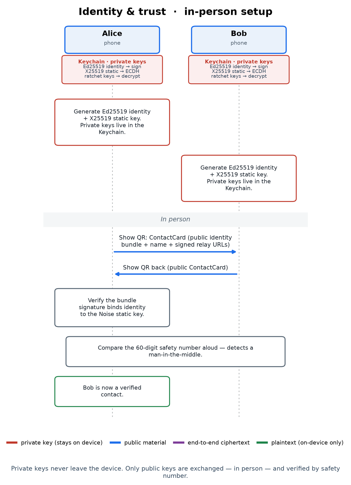
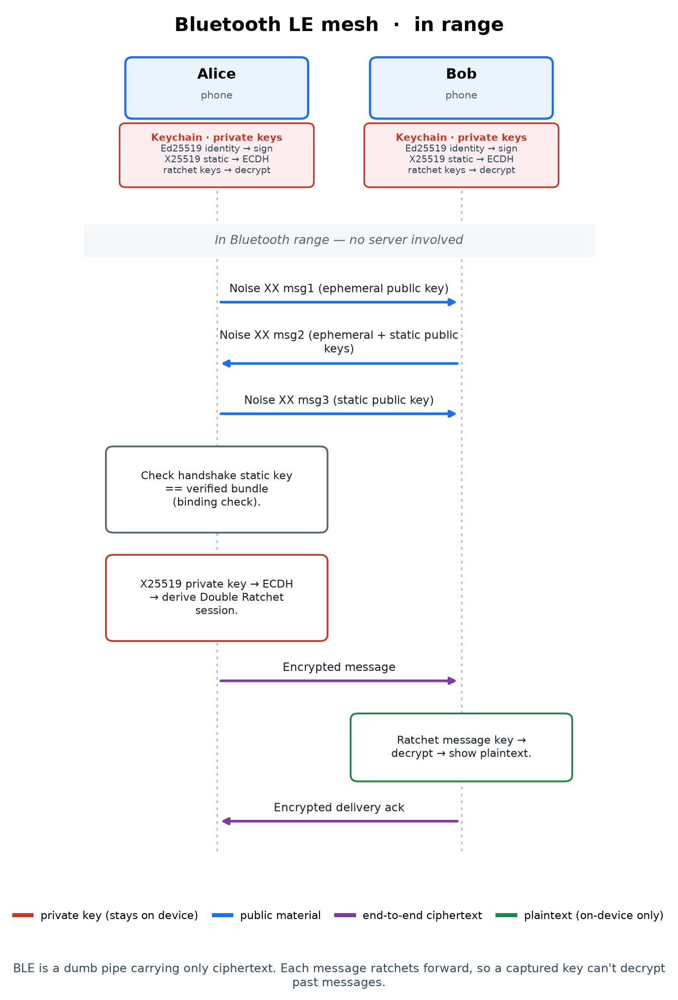
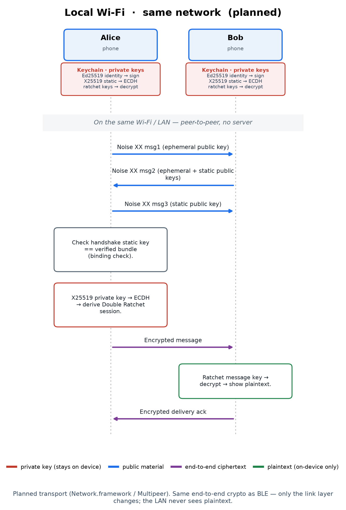
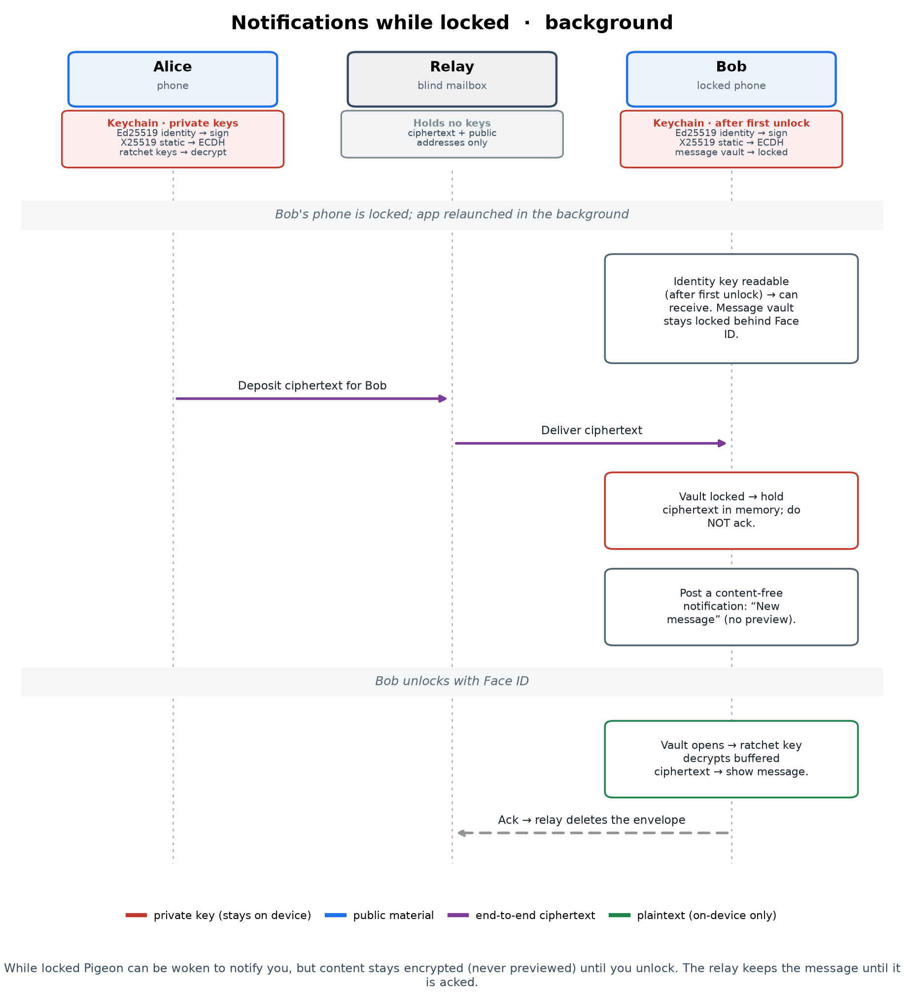
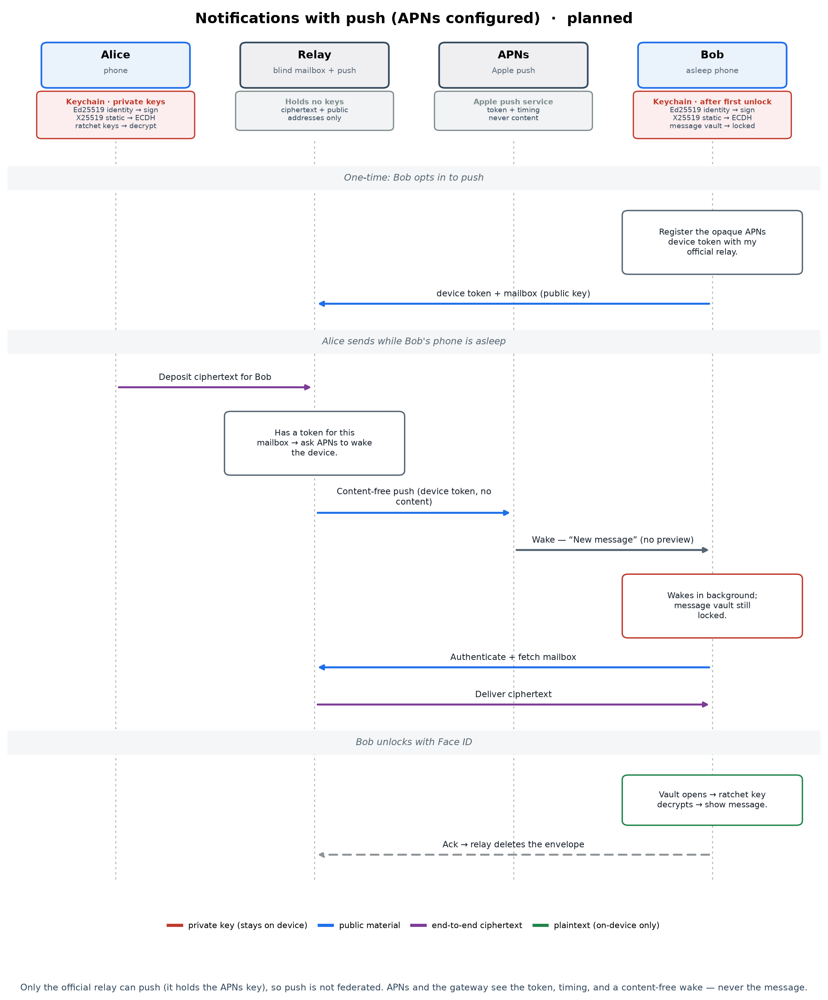

# How Pigeon Works

This is a thorough, plain-language tour of how Pigeon keeps your messages private.
It's written for curious people who are **smart but new to cryptography**: every
term is defined the first time it appears, intuition comes first, and then the
*actual* mechanism — named primitives and all — follows. Where a claim rests on
real cryptography that you might want to verify, it's **cited**; full sources are
in [References](#references).

For the precise, audit-oriented treatment, read the
[Security Model](SECURITY_MODEL.md). This is the long, friendly version.

---

## The one big idea: end-to-end encryption

Put a message in a steel box, lock it, hand it to a courier. The courier carries
it across town to your friend, who has the only key that opens it. The courier
never sees inside — and it doesn't matter if the courier is nosy, hacked, or
secretly hostile.

That's **end-to-end encryption (E2EE)**: a message is locked on *your* device and
unlocked only on your friend's. Everything in between is an untrusted courier
moving a box it can't open. Pigeon has several couriers — Bluetooth, Wi-Fi,
internet relays — and the crucial design choice is that **the lock is identical
regardless of courier.** The rest of this document explains (1) what the lock is
made of and (2) how two phones agree on a key that *only they* know, over a
channel that someone may be watching.

---

## Building block 1 — Two kinds of keys

### Symmetric keys (one shared secret)

The simplest encryption uses **one** secret key to both lock and unlock, like a
physical key that works in both directions. This is **symmetric** encryption.
Pigeon's symmetric workhorse is **ChaCha20-Poly1305**, a modern cipher
standardized for internet use ([RFC 8439][rfc8439]).

It's specifically an **AEAD** — *Authenticated Encryption with Associated Data*
([Rogaway 2002][aead]). AEAD gives you two guarantees at once:

- **Confidentiality:** without the key, the ciphertext is indistinguishable from
  random noise.
- **Integrity/authenticity:** if anyone flips even one bit of the ciphertext (or
  of the unencrypted headers "associated" with it), decryption *fails loudly*
  rather than returning garbage. You cannot tamper undetected.

The catch: symmetric encryption needs both parties to already share the secret
key. Which raises the central question of all messaging crypto — *how do two
phones agree on a shared secret without ever transmitting it?* That needs the
second kind of key.

### Asymmetric keys (a public/private pair)

In **public-key** (asymmetric) cryptography, each device has a **key pair**: a
**public key** safe to hand to anyone, and a **private key** that never leaves the
device. They're linked by a mathematical "trapdoor" — easy to compute one way,
infeasible to reverse. This idea was introduced by Diffie and Hellman in 1976
([New Directions in Cryptography][dh76]).

Pigeon's pairs live on **Curve25519**, an elliptic curve designed by Daniel
Bernstein for speed and to avoid the subtle implementation pitfalls of older
curves ([Bernstein 2006][curve25519]). It's used in two distinct roles, with two
separate keys:

- **X25519** — for *key agreement* (Diffie–Hellman on Curve25519),
  standardized in [RFC 7748][rfc7748]. This is the **static key** on the diagrams.
- **Ed25519** — for *digital signatures* (the EdDSA scheme), standardized in
  [RFC 8032][rfc8032] (paper: [Bernstein et al. 2012][ed25519]). This is the
  **identity key**.

> **Why two keys, not one?** Signing and key-agreement are different jobs with
> different math, and good hygiene keeps them on separate keys. Pigeon's identity
> key *signs* (proves "this came from me") and its static key *agrees on secrets*
> (used to derive shared keys). Apple's Secure Enclave can't hold these — it only
> supports the NIST P-256 curve, not Curve25519 — which is the deliberate
> trade-off noted in the [Security Model](SECURITY_MODEL.md) §4.

The two operations public keys enable:

1. **Signatures.** You stamp data with your **private** Ed25519 key; anyone checks
   the stamp with your **public** key and learns it genuinely came from you and
   wasn't altered. Forging a stamp without the private key is infeasible.
2. **Key agreement (Diffie–Hellman).** Two parties combine *their own private key*
   with *the other's public key* and independently arrive at the **same** shared
   secret — without that secret ever crossing the wire (mechanism below).

On every diagram in this doc, the red **"Keychain · private keys"** badge under
each phone names these keys and their jobs: *Ed25519 identity → sign*, *X25519
static → ECDH*, *ratchet keys → decrypt*. Red is a running reminder: **this
material never leaves the device.**

### Hashes and key derivation

Two more tools appear throughout:

- A **cryptographic hash** turns any input into a fixed-size fingerprint that's
  infeasible to reverse or to collide. Pigeon uses the SHA-2 family
  ([SHA-256/SHA-512][fips180]). Your device's **fingerprint/address** is the
  SHA-256 hash of your public identity key.
- A **KDF** (key derivation function) stretches and mixes secret material into
  fresh keys with clean separation between uses. Pigeon uses **HKDF**
  ([RFC 5869][rfc5869]) and per-message hashing, which is what lets the ratchet
  (below) mint a new key for every message.

---

## Building block 2 — Diffie–Hellman, the "agree on a secret in public" trick

How can two phones end up with the same secret when an eavesdropper sees
everything they exchange?

> **The paint intuition.** You and a friend publicly agree on a common paint
> color. Each secretly picks a private color and mixes it into the common one,
> then you swap the *mixtures* in the open. Each of you mixes your own secret into
> what you received. You both reach the *same* final blend — yet a watcher who saw
> only the common color and the two mixtures can't separate them back out.

Digitally, "mixing" is multiplying points on Curve25519, and "un-mixing" is the
**elliptic-curve discrete logarithm problem**, believed infeasible at this key
size. Concretely (**X25519**, [RFC 7748][rfc7748]): Alice has private `a`/public
`A`, Bob has `b`/`B`. Alice computes `a·B`, Bob computes `b·A`, and the curve math
makes both equal `a·b·G` — the shared secret. The private keys `a` and `b` never
leave their devices; only the public points `A` and `B` are sent. This single
operation — "**ECDH**" on the badges — is the foundation of everything that
follows.

---

## Step 1 — Becoming contacts, in person

*Two phones generate keys, exchange public ContactCards by QR, and verify a safety
number — no server involved.*

Pigeon has no accounts, phone numbers, or central directory. **You are your key
pair**, addressed by your fingerprint. Trust is established the hard-to-fool way:
**in person.**

1. **Each phone generates its keys** (Ed25519 identity + X25519 static) on first
   launch and stores the private halves in the **Keychain** (details in
   [Where the secrets live](#where-the-secrets-live)).
2. **You show each other a QR code** encoding a **ContactCard**: your *public*
   identity key, *public* static key, display name, and any relay addresses. It's
   all public — safe even if photographed by a stranger.
3. **Each phone verifies the card is internally consistent.** The card carries an
   Ed25519 signature, made by the identity key, over the static key. Checking it
   proves the two keys belong together — an attacker can't staple their own static
   key onto your identity.
4. **You compare a safety number.** Pigeon derives one 60-digit number from *both*
   public identity keys — identical on both phones — and you confirm they match
   (read aloud or scanned). This mirrors Signal's "safety number" design
   ([Signal][safetynum]); Pigeon computes it by iterated SHA-512 hashing over the
   two keys sorted into a fixed order, so the result is the same on both devices
   and grinding a collision is expensive.

Why step 4 is the linchpin:

> **The man-in-the-middle (MITM) attack it stops.** Picture an adversary who can
> intercept and relay your traffic, handing each of you *their* key while
> impersonating the other. They could then sit invisibly between you and read
> everything. The defense isn't math alone — it's *human verification*: the safety
> number is computed from the **real** keys each phone holds, so an injected key
> changes it. Comparing it while looking at your actual friend is what anchors the
> cryptography to a real person. (Authenticated key exchange formalizes exactly
> this guarantee; see the Signal protocol analysis, [Cohn-Gordon et al.
> 2017][signalanalysis].)

After this, your friend is a **verified contact**, permanently.

---

## Step 2 — Opening a channel: the Noise XX handshake

Now both phones must derive a shared secret *and* each confirm **who** the other
is. Pigeon uses a handshake from the **Noise Protocol Framework**
([Perrin, Noise spec][noise]) — a well-analyzed toolkit for building exactly these
exchanges. Pigeon's specific suite is **`Noise_XX_25519_ChaChaPoly_SHA256`**
(Security Model §5.2): the `XX` *pattern* over `X25519` key agreement,
`ChaCha20-Poly1305` AEAD, and `SHA-256` hashing.

The `XX` pattern uses two kinds of keys per side:

- an **ephemeral** key — fresh, random, thrown away after the handshake; and
- the long-term **static** key — the identity established in Step 1.

Across three messages, the parties perform several Diffie–Hellman operations,
mixing ephemeral-with-ephemeral, ephemeral-with-static, and static-with-static.
Each DH result is folded (via the KDF) into a running secret, and a running
**transcript hash** binds every byte exchanged so a tampered handshake can't
succeed. The outcome:

- **a shared secret** no eavesdropper can reconstruct (they only saw public
  points), with **forward secrecy** from the ephemeral keys — recording the
  traffic and stealing the static keys *later* still won't reveal it; and
- **mutual authentication**: each side proves possession of its static private
  key, so each learns the other's verified static public key.

Then Pigeon adds one project-specific check — the **binding check**: it confirms
the static key proven in the handshake **equals the static key in the ContactCard
you verified in person** (Security Model §4). This staples the encrypted channel
to the specific human you checked, so "encrypted" also means "encrypted *to the
right person*."

---

## Step 3 — Every message its own key: the Double Ratchet

The handshake yields a shared secret, but Pigeon doesn't just reuse it forever. It
runs the **Double Ratchet** ([Perrin & Marlinspike][doubleratchet]), the algorithm
behind Signal, WhatsApp, and others.

"Ratchet" = a mechanism that only moves forward and can't be wound back. There are
two interlocking ratchets:

- **The symmetric-key ratchet.** For each message, a per-message **message key** is
  derived from a "chain key" via a one-way KDF, and the chain key is advanced. The
  old message key is *deleted immediately after use.* Because the KDF is one-way,
  knowing a current key tells you nothing about previous ones.
- **The Diffie–Hellman ratchet.** Periodically (as each side replies), the parties
  attach a fresh ephemeral public key and perform a new DH, injecting brand-new
  randomness into the key schedule. This is what lets the conversation *recover*
  after a compromise.

Together they provide two properties worth naming:

- **Forward secrecy** — past messages stay confidential even if the device is
  later compromised, because their keys were already destroyed. (The general
  principle dates to the authenticated-key-exchange literature; see
  [Cohn-Gordon et al. 2017][signalanalysis].)
- **Post-compromise security** ("self-healing") — if an attacker transiently
  learns a key, the next DH-ratchet step locks them back out
  ([Cohn-Gordon, Cremers & Garratt 2016][pcs]).

On the diagrams this is the *"ratchet message key → decrypt"* step — and it's why
stealing one key can never unlock your whole history.

> **Async first contact (planned).** The Noise XX handshake above needs both
> parties to exchange handshake messages (possibly via store-and-forward). To let
> you message a brand-new contact who is currently offline, the
> [Roadmap](ROADMAP.md) includes **X3DH**-style prekeys
> ([Marlinspike & Perrin][x3dh]) — published one-time public keys that let a
> sender start a session without the recipient online.

---

## Step 4 — The couriers (transports)

Everything above produces **ciphertext** — the locked box. It then travels over
whatever connection is available; multiple transports can run at once, and none
can read the box.

### Bluetooth LE mesh — when you're nearby

*The full Noise handshake and an encrypted message over Bluetooth — no server.*

In range, two phones talk directly with no internet or account. If a peer is just
out of range, nearby Pigeon devices forward the still-locked box onward — a
**mesh**. Each hop sees only ciphertext (plus a small amount of routing
metadata). This works on a plane, at a protest, during an outage — anywhere the
internet is absent or untrusted.

### Local Wi-Fi — same lock, more bandwidth *(planned)*

*Identical end-to-end crypto to Bluetooth; only the link layer changes.*

A planned transport for devices on the same network. The diagram is deliberately
the *same* as Bluetooth apart from the courier — the whole point of Pigeon's
pluggable transport design. The LAN carries only ciphertext.

### Relay — when you're far apart *(zero-knowledge)*

*A blind mailbox: it stores opaque ciphertext addressed by public key and never
sees content or private keys.*

Two phones on different networks (e.g. both on cellular) usually can't connect
directly: behind NAT, a phone can dial out but not be dialed in. They need a
mutually reachable rendezvous on the internet. Pigeon's is a **relay** — a
deliberately dumb, **zero-knowledge** mailbox. What makes trusting it unnecessary:

- **Your mailbox address is just your public key.** To *read* it you prove
  ownership via **challenge–response**: the relay sends a random nonce, you sign it
  with your Ed25519 **private** key (which never leaves the phone), and the relay
  verifies the signature against your public key. The relay only ever learns
  *public* keys.
- Anyone can **drop off** a locked box for your mailbox; the relay **stores and
  forwards** it (up to 7 days) until you fetch it, then deletes it once your phone
  acknowledges receipt.
- The relay **never** sees plaintext, holds no keys, and cannot forge a message
  (integrity/authenticity are guaranteed end-to-end by the AEAD and the session).
  See its gray badge: *"Holds no keys."*

What a relay *can* observe is **metadata** — that some ciphertext was deposited for
some public key, its size, and timing. That's not nothing, which is why relays are
**opt-in** and **federated**: anyone can run one, you choose which, and you can
self-host. Reducing this metadata further (padding, sealed-sender addressing,
optional Tor) is on the [Roadmap](ROADMAP.md).

---

## Step 5 — Notifications without leaking

A locked phone is the hard case. To *decrypt*, Pigeon must open its on-device
message store, which is sealed behind Face ID / your passcode — and you can't do
Face ID while the phone is asleep in your pocket. The design threads this needle.

### Today: notify now, decrypt at unlock

*A locked phone receives ciphertext, shows a content-free alert, and decrypts only
after you unlock.*

1. The phone can still **receive**: its identity key is readable in the background
   after the first unlock since boot (Apple's `AfterFirstUnlock` data-protection
   class — [Apple Platform Security][appsec]). The message store stays sealed (the
   badge reads *"message vault → locked"*).
2. It therefore **can't decrypt**, so it holds the locked box in memory and posts a
   **content-free** alert — just "New message," no sender, no preview. It also
   does *not* yet acknowledge the relay, so the box is safely retained server-side
   until you actually read it.
3. On unlock, the store opens, the ratchet decrypts the buffered box, and the
   message appears.

> Even the notification reveals nothing about who messaged you or what they said —
> a deliberate lock-screen privacy choice.

### Planned: push wake-ups via APNs

*A content-free push wakes the phone; the message itself never travels through
Apple.*

iOS eventually suspends a backgrounded app, so for reliable delivery hours later,
Pigeon plans to use Apple Push Notification service (**APNs**,
[Apple developer docs][apns]) purely as a doorbell:

- You **opt in**; your phone registers an opaque APNs token with Pigeon's
  **official** relay. (Only the app's publisher can push to the app, so this part
  can't be federated — it lives on the official relay only; see the
  [Roadmap](ROADMAP.md) and issue tracker.)
- When a box arrives, the relay asks APNs to send a **content-free** wake-up. Your
  phone wakes, fetches the locked box, and — as before — only decrypts after you
  unlock.
- Apple and the gateway see a **token, timing, and a blank wake** — never your
  message (APNs's gray badge: *"never content"*).

This trades a little "someone pinged this device" metadata for reliable
notifications, strictly opt-in. Confidentiality remains end-to-end.

---

## What an attacker can and can't do

**A snoop on the wire, a malicious or hacked relay, or your phone company *cannot*:**

- read your messages — they only ever hold AEAD ciphertext ([RFC 8439][rfc8439]);
- impersonate a contact you verified in person — the safety number + binding check
  expose a substituted key;
- recover past messages from a key stolen later — the ratchet already deleted it
  (forward secrecy, [Cohn-Gordon et al. 2017][signalanalysis]).

**They *can* still learn some things — and Pigeon says so plainly:**

- A **relay** sees metadata (that ciphertext moved for some public key, its size,
  timing). Opt-in; mitigations planned.
- Over **Bluetooth**, nearby devices can detect a Pigeon device's presence.
- If your phone is taken while **unlocked**, your messages are exposed — no app can
  protect an unlocked device in someone else's hand.

And the standing caveat: **Pigeon is pre-audit.** The building blocks (CryptoKit,
Noise, the Double Ratchet) are well-studied, but the assembled system has not yet
had an independent security audit and must not be treated as proven-secure. See
the [Security Model](SECURITY_MODEL.md) and [Roadmap](ROADMAP.md).

---

## Where the secrets live

- **Private keys** (Ed25519 identity + X25519 static) are stored in the iPhone
  **Keychain**, marked *this-device-only*: never synced to iCloud, never in
  backups, never moved to another device. Their *lock-state* accessibility is
  `WhenUnlocked` by default, or `AfterFirstUnlock` if you enable background
  delivery — both are Apple data-protection classes ([Apple Platform
  Security][appsec]).
- The **message store** is encrypted with a key sealed behind **Face ID /
  passcode**, so your history stays locked until you authenticate even if the
  phone is in hand.
- **No key is ever sent to any server.** Servers handle locked boxes only.

That's the whole system: verify a friend once, in person; agree on a secret no one
else can compute (Diffie–Hellman); authenticate who you're talking to (Noise XX +
the binding check); give every message its own disposable key (the Double
Ratchet); and let any courier carry the locked box, because none of them hold the
key to open it.

---

## References

Standards and specifications:

- **RFC 7748** — *Elliptic Curves for Security* (X25519 key
  agreement). <https://www.rfc-editor.org/rfc/rfc7748>
- **RFC 8032** — *Edwards-Curve Digital Signature Algorithm (EdDSA)* (Ed25519).
  <https://www.rfc-editor.org/rfc/rfc8032>
- **RFC 8439** — *ChaCha20 and Poly1305 for IETF Protocols* (the AEAD cipher).
  <https://www.rfc-editor.org/rfc/rfc8439>
- **RFC 5869** — *HMAC-based Key Derivation Function (HKDF)*.
  <https://www.rfc-editor.org/rfc/rfc5869>
- **FIPS 180-4** — *Secure Hash Standard* (SHA-256 / SHA-512).
  <https://csrc.nist.gov/pubs/fips/180-4/upd1/final>
- **Noise Protocol Framework** — Trevor Perrin, Rev. 34, 2018.
  <https://noiseprotocol.org/noise.html>
- **The Double Ratchet Algorithm** — Trevor Perrin & Moxie Marlinspike, 2016.
  <https://signal.org/docs/specifications/doubleratchet/>
- **The X3DH Key Agreement Protocol** — Marlinspike & Perrin, 2016.
  <https://signal.org/docs/specifications/x3dh/>
- **Signal safety numbers** — Signal Support.
  <https://support.signal.org/hc/en-us/articles/360007060632>
- **Apple Platform Security** — Keychain data protection classes & APNs.
  <https://support.apple.com/guide/security/welcome/web>
- **Apple — Apple Push Notification service (APNs)**.
  <https://developer.apple.com/documentation/usernotifications>

Foundational papers:

- **W. Diffie & M. Hellman**, *New Directions in Cryptography*, IEEE Trans.
  Information Theory, 1976. <https://doi.org/10.1109/TIT.1976.1055638>
- **D. J. Bernstein**, *Curve25519: New Diffie-Hellman Speed Records*, PKC 2006.
  <https://cr.yp.to/ecdh.html>
- **D. J. Bernstein, N. Duif, T. Lange, P. Schwabe, B.-Y. Yang**, *High-speed
  high-security signatures* (Ed25519), 2012. <https://ed25519.cr.yp.to/>
- **P. Rogaway**, *Authenticated-Encryption with Associated-Data* (AEAD), CCS 2002.
  <https://web.cs.ucdavis.edu/~rogaway/papers/ad.html>
- **K. Cohn-Gordon, C. Cremers, B. Dowling, L. Garratt, D. Stebila**, *A Formal
  Security Analysis of the Signal Messaging Protocol*, EuroS&P 2017.
  <https://eprint.iacr.org/2016/1013>
- **K. Cohn-Gordon, C. Cremers, L. Garratt**, *On Post-Compromise Security*, IEEE
  CSF 2016. <https://eprint.iacr.org/2016/221>

*The diagrams are generated from
[`docs/diagrams/generate_diagrams.py`](diagrams/generate_diagrams.py) — run
`uv run docs/diagrams/generate_diagrams.py` to regenerate them after a protocol
change.*

[rfc7748]: https://www.rfc-editor.org/rfc/rfc7748
[rfc8032]: https://www.rfc-editor.org/rfc/rfc8032
[rfc8439]: https://www.rfc-editor.org/rfc/rfc8439
[rfc5869]: https://www.rfc-editor.org/rfc/rfc5869
[fips180]: https://csrc.nist.gov/pubs/fips/180-4/upd1/final
[noise]: https://noiseprotocol.org/noise.html
[doubleratchet]: https://signal.org/docs/specifications/doubleratchet/
[x3dh]: https://signal.org/docs/specifications/x3dh/
[safetynum]: https://support.signal.org/hc/en-us/articles/360007060632
[appsec]: https://support.apple.com/guide/security/welcome/web
[apns]: https://developer.apple.com/documentation/usernotifications
[dh76]: https://doi.org/10.1109/TIT.1976.1055638
[curve25519]: https://cr.yp.to/ecdh.html
[ed25519]: https://ed25519.cr.yp.to/
[aead]: https://web.cs.ucdavis.edu/~rogaway/papers/ad.html
[signalanalysis]: https://eprint.iacr.org/2016/1013
[pcs]: https://eprint.iacr.org/2016/221
