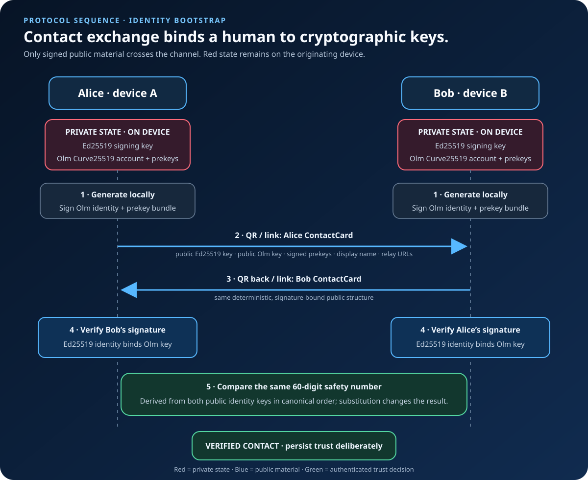
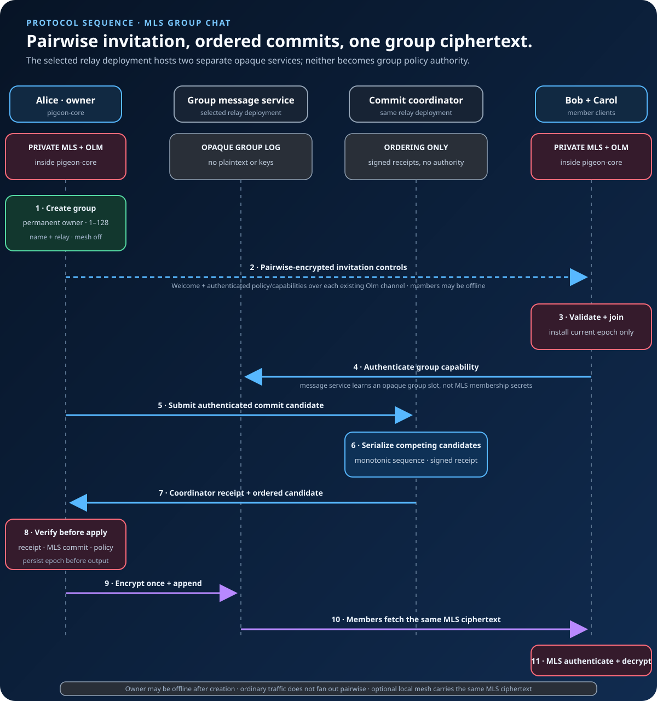
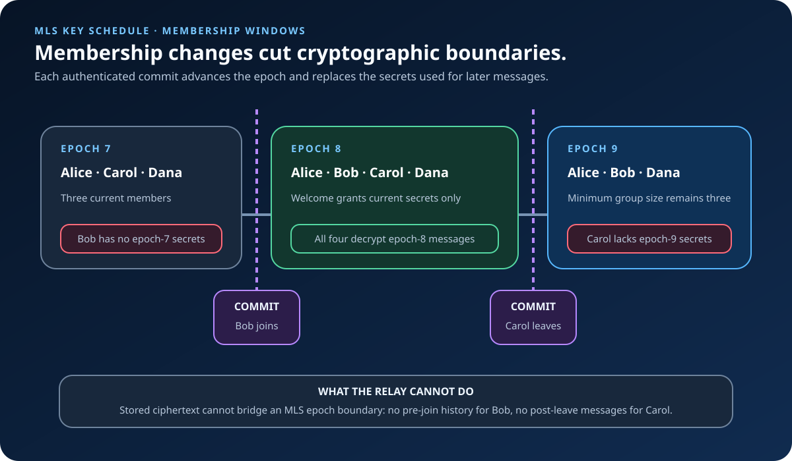
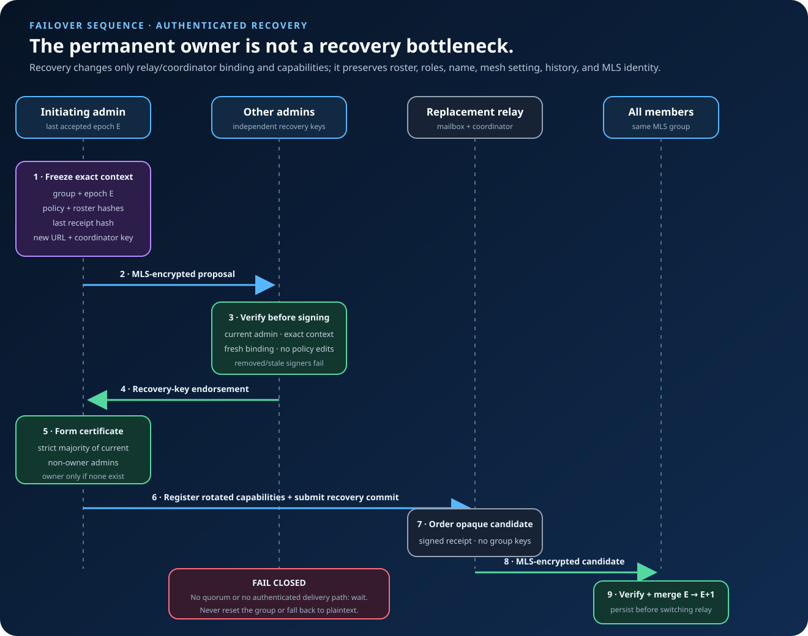

# How Pigeon Works

This is a thorough tour of how Pigeon keeps your messages private.

For the precise, audit-oriented treatment, read the
[Security Model](SECURITY_MODEL.md).

---

## The one big idea: end-to-end encryption

Put a message in a steel box, lock it, hand it to a courier. The courier carries
it across town to your friend, who has the only key that opens it. The courier
never sees inside — and it doesn't matter if the courier is nosy, hacked, or
secretly hostile.

That's **end-to-end encryption (E2EE)**: a message is locked on *your* device and
unlocked only on your friend's. Everything in between is an untrusted courier
moving a box it can't open. Pigeon has several couriers — Bluetooth, Wi-Fi,
internet relays — and the crucial design choice is that **the lock is identical
regardless of courier.** The rest of this document explains (1) what the lock is
made of and (2) how two phones agree on a key that *only they* know, over a
channel that someone may be watching.

---

## Building block 1 — Two kinds of keys

### Symmetric keys (one shared secret)

The simplest encryption uses **one** secret key to both lock and unlock, like a
physical key that works in both directions. This is **symmetric** encryption.
Direct Olm chats use **AES-256**, the Advanced Encryption Standard at its
256-bit key size ([FIPS 197][fips197]). MLS group chats use the standardized
AES-128-GCM cipher suite selected by OpenMLS.

But a cipher alone only hides content; it doesn't stop tampering. Every secret
Pigeon stores or sends is therefore **authenticated** too:

- **Confidentiality:** without the key, the ciphertext is indistinguishable from
  random noise.
- **Integrity/authenticity:** if anyone flips even one bit, decryption *fails
  loudly* rather than returning garbage — you cannot tamper undetected.

Standard constructions provide that second guarantee. Direct Olm messages use
**AES-256-CBC encrypt-then-MAC**: encrypt with AES, then stamp the ciphertext
with **HMAC-SHA256** (a keyed hash) so any change is detected — the classic
authenticated-encryption recipe ([Bellare & Namprempre 2000][etm]). MLS messages
use AES-GCM authenticated encryption. At-rest storage on the device uses
**AES-256-GCM**, a single-pass **AEAD** mode —
*Authenticated Encryption with Associated Data* ([Rogaway 2002][aead]) — that
locks content and authenticity together in one operation.

The catch: symmetric encryption needs both parties to already share the secret
key. Which raises the central question of all messaging crypto — *how do two
phones agree on a shared secret without ever transmitting it?* That needs the
second kind of key.

### Asymmetric keys (a public/private pair)

In **public-key** (asymmetric) cryptography, each device has a **key pair**: a
**public key** safe to hand to anyone, and a **private key** that never leaves the
device. They're linked by a mathematical "trapdoor" — easy to compute one way,
infeasible to reverse. This idea was introduced by Diffie and Hellman in 1976
([New Directions in Cryptography][dh76]).

Pigeon's pairs live on **Curve25519**, an elliptic curve designed by Daniel
Bernstein for speed and to avoid the subtle implementation pitfalls of older
curves ([Bernstein 2006][curve25519]). It's used in two distinct roles, with two
separate keys:

- **X25519** — for *key agreement* (Diffie–Hellman on Curve25519),
  standardized in [RFC 7748][rfc7748]. This is the key the **Olm** session
  protocol (below) uses as a device's **Curve25519 identity key** and for every
  ratchet step.
- **Ed25519** — for *digital signatures* (the EdDSA scheme), standardized in
  [RFC 8032][rfc8032] (paper: [Bernstein et al. 2012][ed25519]). This is Pigeon's
  long-term **identity key** — the root of who you are.

> **Why two keys, not one?** Signing and key-agreement are different jobs with
> different math, and good hygiene keeps them on separate keys. Pigeon's Ed25519
> identity key *signs* (proves "this came from me") while the Curve25519 key
> *agrees on secrets* (used to derive shared keys). Apple's Secure Enclave can't
> hold these — it only supports the NIST P-256 curve, not Curve25519 — which is
> the deliberate trade-off noted in the [Security Model](SECURITY_MODEL.md) §4.

The two operations public keys enable:

1. **Signatures.** You stamp data with your **private** Ed25519 key; anyone checks
   the stamp with your **public** key and learns it genuinely came from you and
   wasn't altered. Forging a stamp without the private key is infeasible.
2. **Key agreement (Diffie–Hellman).** Two parties combine *their own private key*
   with *the other's public key* and independently arrive at the **same** shared
   secret — without that secret ever crossing the wire (mechanism below).

On every diagram in this doc, red identifies private cryptographic state. The
long-term Ed25519 signing key lives in the Keychain; sealed core checkpoints
contain Olm and MLS state under the presence-gated vault key. None of it leaves
the device in plaintext.

### Hashes and key derivation

Two more tools appear throughout:

- A **cryptographic hash** turns any input into a fixed-size fingerprint that's
  infeasible to reverse or to collide. Pigeon uses the SHA-2 family
  ([SHA-256/SHA-512][fips180]). Your device's **fingerprint/address** is the
  SHA-256 hash of your public identity key.
- A **KDF** (key derivation function) stretches and mixes secret material into
  fresh keys with clean separation between uses. Pigeon uses **HKDF**
  ([RFC 5869][rfc5869]) and per-message hashing, which is what lets the ratchet
  (below) mint a new key for every message.

---

## Building block 2 — Diffie–Hellman, the "agree on a secret in public" trick

How can two phones end up with the same secret when an eavesdropper sees
everything they exchange?

> **The paint intuition.** You and a friend publicly agree on a common paint
> color. Each secretly picks a private color and mixes it into the common one,
> then you swap the *mixtures* in the open. Each of you mixes your own secret into
> what you received. You both reach the *same* final blend — yet a watcher who saw
> only the common color and the two mixtures can't separate them back out.

Digitally, "mixing" is multiplying points on Curve25519, and "un-mixing" is the
**elliptic-curve discrete logarithm problem**, believed infeasible at this key
size. Concretely (**X25519**, [RFC 7748][rfc7748]): Alice has private `a`/public
`A`, Bob has `b`/`B`. Alice computes `a·B`, Bob computes `b·A`, and the curve math
makes both equal `a·b·G` — the shared secret. The private keys `a` and `b` never
leave their devices; only the public points `A` and `B` are sent. This single
operation — "**ECDH**" on the badges — is the foundation of everything that
follows.

---

## Step 1 — Becoming contacts, nearby or remote

*Two phones generate keys, exchange public ContactCards by QR or contact link,
and verify a safety number.*

Pigeon has no accounts, phone numbers, or central directory. **You are your key
pair**, addressed by your fingerprint. Nearby contacts can scan QR codes. People
anywhere in the world can exchange `https://pigeonwire.app/contact` links through a channel
they already use; the link contains the same public card and Pigeon clearly marks
that contact as not verified in person.

1. **Each phone generates its keys** (an Ed25519 identity key, plus an Olm
   account holding a Curve25519 identity key and a pool of prekeys) on first
   launch. The Ed25519 private key lives in the **Keychain**; evolving Olm state
   lives in the atomically persisted, encrypted core checkpoint (details in
   [Where the secrets live](DELIVERY_AND_PRIVACY.md#where-the-secrets-live)).
2. **You exchange a ContactCard** by scanning each other's QR codes or sharing
   contact links. The card contains your *public* Ed25519 identity key, your
   *public* Olm Curve25519 key, a signed *prekey* bundle (so people can message
   you while you're offline — see Step 2), a display name, and any relay
   addresses. It's all public — safe even if photographed or forwarded.
3. **Each phone verifies the card is internally consistent.** The card carries an
   Ed25519 signature, made by the identity key, over the Curve25519 key. Checking
   it proves the two keys belong together — an attacker can't staple their own
   Curve25519 key onto your identity.
4. **You compare a safety number.** Pigeon derives one 60-digit number from *both*
   public identity keys — identical on both phones — and you confirm they match
   in person or over a trusted channel. Until this happens, a remotely imported
   contact remains visibly unverified. This mirrors Signal's "safety number" design
   ([Signal][safetynum]); Pigeon computes it by iterated SHA-512 hashing over the
   two keys sorted into a fixed order, so the result is the same on both devices
   and grinding a collision is expensive.

Why step 4 is the linchpin:

> **The man-in-the-middle (MITM) attack it stops.** Picture an adversary who can
> intercept and relay your traffic, handing each of you *their* key while
> impersonating the other. They could then sit invisibly between you and read
> everything. The defense isn't math alone — it's *human verification*: the safety
> number is computed from the **real** keys each phone holds, so an injected key
> changes it. Comparing it while looking at your actual friend is what anchors the
> cryptography to a real person. (Authenticated key exchange formalizes exactly
> this guarantee; see the Signal protocol analysis, [Cohn-Gordon et al.
> 2017][signalanalysis].)

After this, your friend is a **verified contact**, permanently.

---

## Step 2 — Opening a channel: an Olm session

Now both phones must derive a shared secret *and* each confirm **who** the other
is. Pigeon does this with **Olm**, the session protocol from the Matrix project,
as implemented by the audited [`vodozemac`][vodozemac] Rust crate. Pigeon does
**not** re-implement the ratchet or the key math — it drives Olm's account and
session API and adds exactly one thing of its own: the identity check at the end.

Olm is **asynchronous**: the sender does **not** need the recipient online. That
matters enormously for a mesh — peers are out of range all the time. It works
through **prekeys**: keys the recipient publishes *ahead of time* in its
ContactCard so anyone can start a session with them later.

- Each device's Olm account holds a long-term **Curve25519 identity key**, a
  rotating **signed prekey**, and a pool of **one-time prekeys** — all public,
  all carried in the QR card from Step 1, and each one signed by the Ed25519
  identity key.
- To open a session, the sender generates a fresh **ephemeral** key and performs
  several Diffie–Hellman operations against the recipient's published keys —
  ephemeral-with-identity, ephemeral-with-signed-prekey, ephemeral-with-one-time
  — and folds the results together (via **HKDF-SHA256**) into a shared root
  secret. This is the same multi-DH idea pioneered by Signal's X3DH
  ([Marlinspike & Perrin][x3dh]); Olm uses it as its session-setup step.
- That first encrypted message carries the sender's ephemeral and one-time-key
  choices, so the recipient — whenever it next comes online — can run the
  matching DHs and arrive at the *same* root secret. The one-time prekey is then
  **deleted**, so it can never be reused.

The outcome is the same as any good handshake: **a shared secret** no
eavesdropper can reconstruct (they only saw public points), with **forward
secrecy** from the ephemeral and one-time keys, plus each side learning the
other's Curve25519 identity key.

Then Pigeon adds its one project-specific check — the **binding check**: it
confirms the Curve25519 identity key in the session **equals the one in the
ContactCard you verified in person**, which the Ed25519 identity signed (Security
Model §5.2). This staples the encrypted channel to the specific human you checked,
so "encrypted" also means "encrypted *to the right person*."

---

## Step 3 — Every message its own key: the Double Ratchet

The handshake yields a shared secret, but Pigeon doesn't just reuse it forever. It
runs the **Double Ratchet** ([Perrin & Marlinspike][doubleratchet]), the algorithm
behind Signal, WhatsApp, and others.

"Ratchet" = a mechanism that only moves forward and can't be wound back. There are
two interlocking ratchets:

- **The symmetric-key ratchet.** For each message, a per-message **message key** is
  derived from a "chain key" via a one-way KDF, and the chain key is advanced. The
  old message key is *deleted immediately after use.* Because the KDF is one-way,
  knowing a current key tells you nothing about previous ones.
- **The Diffie–Hellman ratchet.** Periodically (as each side replies), the parties
  attach a fresh ephemeral public key and perform a new DH, injecting brand-new
  randomness into the key schedule. This is what lets the conversation *recover*
  after a compromise.

Together they provide two properties worth naming:

- **Forward secrecy** — past messages stay confidential even if the device is
  later compromised, because their keys were already destroyed. (The general
  principle dates to the authenticated-key-exchange literature; see
  [Cohn-Gordon et al. 2017][signalanalysis].)
- **Post-compromise security** ("self-healing") — if an attacker transiently
  learns a key, the next DH-ratchet step locks them back out
  ([Cohn-Gordon, Cremers & Garratt 2016][pcs]).

On the diagrams this is the *"ratchet message key → decrypt"* step — and it's why
stealing one key can never unlock your whole history.

> **You can message someone who's offline.** Because the Olm session in Step 2 is
> built from the recipient's *published* prekeys, you never need both phones awake
> at once. Your first message ships as a self-contained "pre-key message" — it
> carries everything the recipient needs to derive the shared secret whenever they
> next come online, over Bluetooth or via a relay. From their reply onward, the
> Double Ratchet above takes over.

---

## Step 4 — Group chats with MLS

Direct chats use one Olm Double Ratchet per pair. Group chats use the IETF
**Messaging Layer Security** protocol ([MLS, RFC 9420][rfc9420]), implemented by
OpenMLS inside `pigeon-core`. MLS maintains a shared group key schedule while
updating membership in logarithmic rather than linear work. Swift, the FFI, the
relay, and transports handle typed commands, public policy, and opaque
ciphertext; they never manipulate MLS secrets.

The owner selects one configured relay for the group. That deployment exposes
both the ciphertext mailbox and the MLS coordinator. The coordinator serializes
concurrent membership and policy commits and signs its receipts, but it is not a
group authority: every client verifies the receipt, the MLS commit, and Pigeon's
authenticated policy before changing state. It has no plaintext or group keys.
After creation, the owner can be offline; invitations travel through existing
pairwise-encrypted control channels and the selected relay completes coordination.
An ordinary member's signed leave proposal also travels pairwise to current
admins, so any online admin can submit the canonical removal without waiting for
the owner.

Pigeon groups have these product rules:

- 1–128 members, with mutable membership.
- A permanent owner who cannot be demoted or removed. Admins can add/remove
  members and promote/demote other admins; no admin can demote themself.
- Members other than the owner can leave while at least three members remain.
  The owner can permanently dissolve the group. Nobody can post after that, but
  the relay keeps the group readable for a while (30 days by default) so members
  who were offline still learn it ended.
- Only the owner can change the shared name or selected relay. Group traffic
  uses the selected relay; local mesh remains available for pairwise chats.
- Membership and policy changes appear as status entries in the conversation,
  while verification failures appear as prominent security warnings.
- "Delivered to" counts arrive in batches: each phone waits a few seconds (longer
  in bigger groups) and then confirms everything it received in one encrypted
  receipt, so a busy group doesn't flood its relay mailbox.

MLS advances the group to a new **epoch** after membership changes. A new member
receives the current epoch secrets, not the keys for earlier messages. A removed
or departed member does not receive later epoch secrets. Pigeon therefore shows
new members only messages sent after they joined; the relay cannot bridge that
cryptographic boundary.

Application messages are encrypted once for the MLS group and uploaded to the
group mailbox. This avoids pairwise fan-out for ordinary group traffic. Pairwise
encryption remains intentionally limited to bootstrapping invitations before a
new member can authenticate to the group mailbox and to routing signed leave
proposals to admins.

Each client persists two independent relay cursors: the group-message cursor and
the signed coordinator receipt sequence. A relay wake schedules both drains, and
bounded fetches continue until empty. An authenticated but invalid coordinator
entry is recorded as a security warning and its receipt is durably consumed, so
one bad entry cannot permanently block later valid commits.

Owner dissolution installs a terminal relay tombstone. It immediately disables
new appends and policy changes, while retaining read authentication and the
terminal coordinator commit for one relay TTL so offline members can still learn
that the group ended. The relay then reclaims the tombstoned group.

### Coordinator and relay recovery

If the selected coordinator can no longer make progress, any current admin can
propose a replacement relay deployment. Recovery does not create a new group or
make the initiating admin an authority. The proposal binds the last accepted
epoch, policy and roster hashes, coordinator receipt head, replacement URL and
coordinator key, and the exact next capability set.

A strict majority of current non-owner admins must endorse that exact proposal.
When there are no delegated admins, the permanent owner is the sole recovery
signer. The replacement deployment registers rotated capabilities and orders one
recovery commit; each client verifies the recovery certificate, signed receipt,
MLS commit, and unchanged policy fields before switching. Recovery controls are
MLS-encrypted once and carried by the existing group mailbox; an opted-in local
mesh carries the same ciphertext during a relay outage. If neither path can
reach quorum members and the remaining roster, recovery waits rather than
resetting identity state or exposing the control data.

Continue with [delivery, notifications, attacker limits, and references](DELIVERY_AND_PRIVACY.md).
