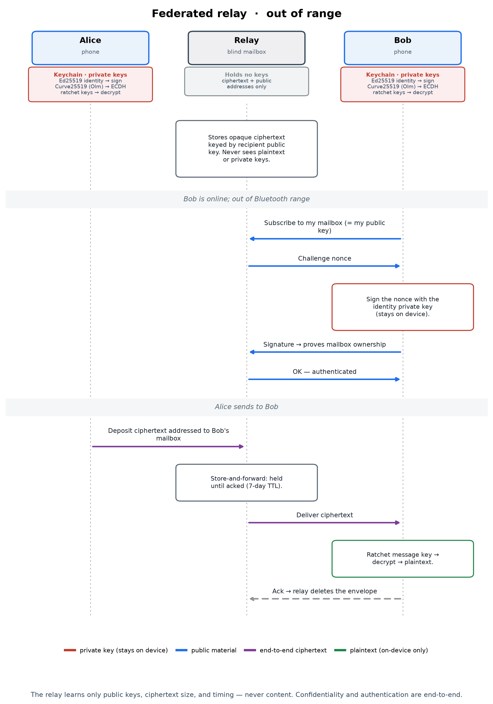

# Pigeon — Security Model

> **Status: pre-release prototype. NOT independently audited.**
> This document describes the design and current implementation of Pigeon's
> security. It is a working model for implementation and review, **not** an
> audit report, and Pigeon should not yet be relied on against a real
> adversary. See [Audit Readiness](#audit-readiness-pre-audit-notes).

Pigeon is an open-source messenger built for **extreme privacy and security**
across offline-capable local transports and federated server transports.
In-range, messages can travel end-to-end encrypted over a local **Bluetooth Low
Energy mesh**. For peers who are **out of local range and on different
networks** (e.g. cellular), Pigeon can deliver the same end-to-end ciphertext
over the internet through a **zero-knowledge relay** — a self-hostable mailbox
that stores and forwards ciphertext addressed by public key and **never sees
plaintext**.

Local mesh and federated relay delivery are transport options, not different
trust models. Relays learn connection metadata (endpoints, timing,
who-exchanges-with-whom) but no content, and they are never trusted for
confidentiality, authentication, or integrity. Identity is a key pair on your
device; there is nothing to register with a central Pigeon service.

---

## 1. Goals

- **Confidentiality** of message contents from relay devices and passive radio
  observers.
- **End-to-end encryption** between conversation participants; intermediate mesh
  relays forward ciphertext they cannot read.
- **Mutual authentication** of peers via long-term identity keys.
- **Human-verifiable trust**: a safety number users compare out of band to
  detect impersonation / man-in-the-middle.
- **Forward secrecy** (a compromised key does not expose past messages) and
  **post-compromise security** (the channel heals after a compromise) at the
  conversation layer.
- **Transport flexibility without weakening trust.** Local and relay transports
  carry the same end-to-end-protected bytes. Relays are blind ciphertext
  mailboxes and are never trusted for confidentiality, authentication, or
  integrity, all of which are enforced end-to-end below the transport.
- **Auditability**: security-critical code is small, dependency-free, and
  readable.

## 2. Non-Goals (current prototype)

- Production-grade security guarantees (pending external audit).
- Anonymity against an adversary observing local Bluetooth radio.
- Strong metadata privacy (who talks to whom, when, message sizes/timing).
- Protection from a compromised or unlocked endpoint device.
- Asynchronous first contact (messaging a peer who has never been in range) —
  deferred; see §6.
- Multi-device identity sync.

---

## 3. Architecture Overview

> **Visual walkthrough.** For an illustrated, plain-language version of the flows
> below — identity exchange, the handshake, the ratchet, and each transport —
> see [How Pigeon Works](HOW_IT_WORKS.md). The per-flow sequence diagrams (showing
> what each party's keys do, and what a relay can and cannot see) are regenerated
> by [`diagrams/generate_diagrams.py`](diagrams/generate_diagrams.py).

```
┌──────────────────────────────────────────────┐
│ App (SwiftUI, iOS target; iPad-on-Mac capable) │
│  onboarding · contacts/QR verify · chat        │
├──────────────────────────────────────────────┤
│ Storage  encrypted-at-rest + ephemeral mode     │
├──────────────────────────────────────────────┤
│ Mesh  packet format · TTL · dedup ·             │
│                 store-and-forward relay          │
├──────────────────────────────────────────────┤
│ Transport (`Transport` protocol)  pluggable pipes│
│   • BLE: CoreBluetooth central+peripheral · GATT │
│   • Relay (opt-in): blind ciphertext mailbox     │
│   moves opaque ciphertext only · runs concurrently│
├──────────────────────────────────────────────┤
│ pigeon-core (Rust, via PigeonCore XCFramework)   │
│   Olm session establishment + Double Ratchet     │
│   (vodozemac) · identity binding on top           │
├──────────────────────────────────────────────┤
│ Identity (app)  Ed25519 key in Keychain,         │
│                 fingerprint, safety number       │
└──────────────────────────────────────────────┘
```

End-to-end encryption is performed by the two conversation endpoints (the Olm
sessions in `pigeon-core`). The mesh layer relays opaque ciphertext;
**relays learn routing/metadata but never plaintext.**

---

## 4. Identity & Trust

- Each device generates a long-term **Ed25519** identity key pair on first
  launch (`Curve25519.Signing` via CryptoKit).
- The private key is stored in the **Keychain**, always `…ThisDeviceOnly`:
  device-only, excluded from iCloud and backups. Its lock-state accessibility
  follows the **background-delivery** preference (see below).
- **Background delivery (opt-out, on by default).** To notify the user of new
  messages while the device is locked, a background relaunch must read the
  identity key to authenticate to the relay. When background delivery is
  enabled, the identity key uses
  `kSecAttrAccessibleAfterFirstUnlockThisDeviceOnly` (readable while locked after
  the first unlock since boot); when disabled, they use the stricter
  `kSecAttrAccessibleWhenUnlockedThisDeviceOnly` (readable only while unlocked).
  The trade-off is a wider window for forensic key extraction from a powered-on,
  already-unlocked device — a hard, narrow attack vector — versus background
  notifications. The message itself is never decrypted while locked: inbound
  envelopes are held in memory (and retained on the relay, unacked) and processed
  only after the vault is unlocked. Plaintext and history stay behind the
  biometric-gated vault regardless of this setting.
- **Secure Enclave is deliberately not used**: it supports only P-256, which is
  incompatible with the X25519/Ed25519 stack the protocols require.
- The public key's **SHA-256 fingerprint** is the device's address/handle.
- Public identities are exchanged **in person via QR code**. From a pair of
  public keys we derive a **60-digit safety number** (order-independent,
  iterated hashing) that users compare out of band to detect MITM.
- **Identity reset** generates a fresh key, irreversibly invalidating all
  existing trust relationships. This is, and must remain, user-visible.

> **Identity ↔ Olm-key binding:** Olm authenticates a session by its
> **Curve25519** identity key, while Pigeon's *identity* is **Ed25519**. These are
> bound via `IdentityBundle` — the Curve25519 identity key is signed by the
> Ed25519 identity, and the signed bundle is the QR payload. At establishment,
> the session's reported peer identity is checked against the verified bundle, so
> comparing safety numbers authenticates the encrypted channel. (Still in scope
> for the overall audit.) See [Audit Readiness](#audit-readiness-pre-audit-notes).

---

## 5. Cryptographic Design

The pairwise messaging protocol is **Olm**, provided by the audited
[`vodozemac`](https://github.com/matrix-org/vodozemac) Rust crate and reached
from the app through the `pigeon-core` / `PigeonCore` XCFramework. Pigeon does
**not** implement the ratchet, session establishment, or any primitive
algorithm; it adds exactly one piece of protocol trust on top of Olm — the
identity binding — and otherwise drives Olm's account/session API. App-side
identity signing and at-rest storage use Apple **CryptoKit**.

### 5.1 Primitives
Olm's cipher suite, as implemented by `vodozemac`:
- **X25519 (Curve25519)** ECDH for session establishment and the Double Ratchet's
  DH steps.
- **HKDF-SHA256** for root/chain key derivation.
- **HMAC-SHA256** for chain-key advancement and message authentication.
- **AES-256-CBC** for message encryption (Encrypt-then-MAC with HMAC-SHA256).

App-side, via CryptoKit:
- **Ed25519** signatures for the identity binding and relay-challenge auth.
- **AES-256-GCM** for at-rest storage (`SecretBox`).
- **SHA-256 / SHA-512** for fingerprints and safety-number derivation.

### 5.2 Identity binding (`pigeon-core` `identity.rs`)
Olm authenticates sessions by **Curve25519** keys, but does not by itself tie a
peer's Curve25519 identity key to a stable, human-verifiable identity. Pigeon's
root of trust is a long-term **Ed25519** identity key (the safety-number root).
That identity key **signs Olm's Curve25519 identity key**, producing the
`IdentityBundle` carried in the QR card. Verifying a peer's safety number
therefore authenticates the whole channel. The Ed25519 identity is independent of
the Olm account, so re-pickling or rotating Olm keys never churns safety numbers.

### 5.3 Sessions & the Double Ratchet (Olm)
- Each device owns one Olm **account** (its Curve25519 identity key, a pool of
  one-time keys, and a fallback key). Each conversation is one Olm **session**.
- The session provides **forward secrecy**, **post-compromise security**, and
  **out-of-order / skipped-message** tolerance — all from vodozemac's Double
  Ratchet, essential over a lossy BLE mesh.
- `pigeon-core`'s `Session` wraps the Olm session only to enforce the identity
  binding at establishment and to report the peer's verified Ed25519 key for the
  safety-number check; after that, encrypt/decrypt are straight Olm.

### 5.4 Wire format
All bundles and messages use the shared **`pigeon.wire.v1`** Protocol Buffer
schema (`proto/pigeon/wire/v1/pigeon_wire.proto`), encoded identically by the
Rust core and the Swift app. An Olm message crosses the wire as
`pigeon.wire.v1.OlmMessage` (its type tag + ciphertext); first contact crosses as
`pigeon.wire.v1.Initiation` (the initiator's identity bundle + the first Olm
pre-key message).

### 5.5 Why Olm/vodozemac
- **Audited ratchet and primitives.** `vodozemac` is a focused, audited Rust
  implementation of Olm/Megolm, so the ratchet and session establishment are not
  Pigeon's own code to get right. This does **not** remove the need for an
  external audit of Pigeon's *use* of it (§Audit Readiness).
- **Cross-platform core.** A Rust core can back future non-Apple clients without
  re-implementing the protocol per platform.
- **Async-first.** Olm establishes from published prekeys without an interactive
  round trip — a natural fit for a mesh/relay network where peers are often
  offline (§5.7).
- **License:** the reusable messaging-core, mesh, and relay packages should
  remain open and copyleft, not source-visible-but-closable.
  **`pigeon-core`, `pigeon-core-ffi`, `PigeonMesh`, and `PigeonRelay` are
  AGPL-3.0-only**, so modified versions offered to users, including over a
  network, must keep their source available. The iOS app and app-specific code
  are source-available for transparency, local development, and security review,
  but are not open source; commercial use, redistribution as an app, and
  App Store/TestFlight publication require permission from the Pigeon
  maintainers.

### 5.6 Constant-time comparisons & key handling

Secret comparisons happen inside vetted code. Olm tag verification and the
ratchet live in `vodozemac`; Ed25519 signature checks (the identity binding and
prekey signatures) run in `ed25519-dalek` (Rust core) and CryptoKit (app). The
one authentication decision Pigeon makes in its own code — that a session's
reported peer identity equals the verified contact's identity key — is a
comparison of **public** Ed25519 keys, so it is defense-in-depth rather than a
confidentiality-critical secret comparison.

Secret key material (the Olm account, session state, message and chain keys) is
owned and zeroized by `vodozemac`. Pigeon's own secret handling is limited to the
32-byte Ed25519 identity seed (Keychain) and the sealed Olm account pickle
(vault); it does not keep ratchet state in long-lived app buffers.

### 5.7 Async first contact — Olm prekeys

Olm is **async-first**: a sender can open a session and send a first message to a
peer who is offline, using prekeys the recipient published ahead of time (in its
QR card, or via mesh/relay). There is no interactive handshake to complete; the
normal Double Ratchet (§5.3) takes over once the peer replies.

**Reuse of existing trust.** No new root of trust is introduced. The recipient's
identity bundle (§5.2) is reused verbatim, and every published prekey is signed
by the same Ed25519 identity, so verifying a peer's safety number authenticates
first contact too. The recipient publishes:
- a **signed fallback prekey** — a long-lived Curve25519 prekey, signed by the
  identity key, always available; and
- a pool of **one-time prekeys (OPKs)** — likewise signed, each consumed once.

`pigeon-core` verifies the identity binding *and* the prekey signature before any
session is opened, so a relay or mesh forwarder cannot substitute a key.

**Establishment.** The initiator runs Olm's outbound session against the
recipient's identity + prekey, encrypts the first plaintext into an Olm **pre-key
message**, and transmits a single `pigeon.wire.v1.Initiation` (its identity
bundle + that pre-key message). The recipient creates the matching inbound
session from the pre-key message, recovering the first plaintext; consuming the
named one-time key is the replay defense.

**Tradeoffs (deliberate, inherent to Olm).**
- **Replay.** A one-time prekey makes first contact single-use: once consumed the
  recipient cannot re-derive the same inbound session, so a replayed initiation
  fails. When the OPK pool is exhausted Olm falls back to the **fallback key**,
  and first-contact replay resistance degrades to the fallback-key rotation
  window — so application-level dedup/freshness is still required. Pigeon
  replenishes OPKs and rotates the fallback key when next online.
- **Exhaustion / availability.** Olm uses the fallback key rather than refusing
  first contact when OPKs run out — availability chosen over denying delivery.
- **Weaker forward secrecy at rest until the first reply.** Until the recipient
  replies and the ratchet performs its first DH step, secrecy rests on the
  long-lived fallback key (or the consumed OPK). This is inherent to async setup
  and is why fallback rotation + OPK consumption matter.
- **No forward secrecy for the prekey-publication metadata** itself; prekeys are
  public by construction.

---

## 6. Transport & Mesh

The transport layer is a pluggable `Transport` abstraction: a "dumb pipe" that
moves **opaque ciphertext** between peers and knows nothing about encryption,
identity, or routing. Encryption (§5) and the mesh sit above it, so every
transport carries the same end-to-end-protected bytes and any number can run at
once.

- **BLE transport:** CoreBluetooth, each device acting as both central and
  peripheral; a custom GATT service; message chunking/reassembly to fit BLE MTUs;
  framing. Offline-capable local delivery with no server involved.
- **Mesh:** packet format with TTL, duplicate-suppression (seen-cache), and
  **store-and-forward** relaying so messages hop toward out-of-range peers.
  Relays handle ciphertext only.
- **Session establishment is async-first:** Olm establishes a session from the
  recipient's published prekeys (signed prekey + a one-time prekey carried in the
  QR card or shared over mesh/relay), so the first encrypted message can be sent
  without the recipient being online. There is no interactive handshake. The
  prekey path has its own replay/exhaustion considerations, handled inside Olm's
  one-time-key accounting (see §5.7).

### 6.1 Relay transport (remote delivery) — opt-in



Two devices that are out of Bluetooth/local-Wi-Fi range and on different networks
(e.g. both on cellular) **cannot connect directly**: behind NAT/CGNAT a phone can
dial out but cannot be dialed in, so there is no peer-to-peer path. Reaching them
requires a mutually-reachable rendezvous — a **server**. This is a property of
the internet, not a Pigeon limitation. Pigeon treats that rendezvous as an
untrusted federated transport, not as part of the security boundary.

Pigeon keeps the trust cost minimal:

- The relay is a **zero-knowledge mailbox**: clients connect *outbound* (e.g.
  WebSocket), upload ciphertext **addressed by recipient public key**, and the
  relay stores-and-forwards it. It is just another `Transport` carrying the same
  ratchet ciphertext — **it cannot read messages**, and confidentiality,
  authentication, integrity, forward secrecy, and the safety-number trust check
  are all unchanged and enforced end-to-end below it.
- It is **opt-in** and **self-hostable** (run your own; a homelab/Kubernetes or
  small VPS deployment is sufficient). The design is **federated** — each user
  advertises the relay(s) they can be reached at in their QR contact card, and a
  sender deposits only on *that recipient's* relays. Independent relays, chosen
  per user, like email or Nostr relays — no single central party, no
  server-to-server protocol.
- **Relay URLs in the card are signed delivery hints.** The identity bundle signs
  the identity ↔ Olm Curve25519 binding; the relay URL list is signed separately
  by the same Ed25519 identity key so cards remain parseable and `pigeon-core`
  stays identity-agnostic about transport. A scanner only honors relay URLs if
  that URL signature verifies. A wrong or malicious relay can observe that
  ciphertext for a key exists, or drop it (a DoS), but it cannot read content or
  affect trust, which live in the signed bundle and the ratchet. Reading a
  mailbox still requires proving ownership of its key (a signed challenge), so a
  relay cannot hand your mailbox to anyone else.
- **What the relay can see is metadata**, not content: client IP/endpoints,
  timing, message sizes, and that *some* sender is delivering to recipient key X.
  Mitigations (sealed-sender addressing, padding, and routing over **Tor** to hide
  IPs) are planned, not yet implemented.

> A relay is **untrusted infrastructure**. Compromising or operating one yields
> metadata and the ability to drop/delay/replay ciphertext (a denial-of-service
> and traffic-analysis position), but **never plaintext, impersonation, or a
> trusted session** — those are gated by the identity ↔ Olm Curve25519 binding
> and the Olm message authentication, which the relay cannot forge.

---

## 7. Attacker Model

**Assume an attacker can:**
- Observe, record, replay, delay, drop, and reorder Bluetooth traffic.
- Operate or compromise relay devices in the mesh.
- **Operate or compromise an internet relay server** (if the user enables relay
  delivery): observe connection metadata — client IP/endpoints, timing, sizes,
  and that a sender is delivering to recipient key X — and drop, delay, or replay
  ciphertext. The relay **cannot** read content, impersonate a peer, or forge a
  trusted session.
- Attempt pairing/identity impersonation and MITM.
- Tamper with any unauthenticated protocol field.
- Read app logs, crash reports, and unprotected on-disk state.
- Perform traffic analysis (timing, sizes, presence) on local radio.

**Assume an attacker cannot:**
- Break CryptoKit primitives (X25519, AES-GCM, ChaCha20-Poly1305, SHA-256, HMAC).
- Extract Keychain items from an uncompromised, locked device.
- Recover plaintext from a non-compromised endpoint after decryption.
- Defeat an out-of-band safety-number comparison performed honestly by users.

---

## 8. Known Limitations

- **Metadata is exposed.** BLE advertisements, packet timing, sizes, and mesh
  routing reveal communication patterns. No padding/cover traffic yet.
- **Relay metadata (if enabled).** An internet relay sees endpoints, timing,
  sizes, and sender→recipient-key mappings — never content. Sealed-sender,
  padding, and Tor routing to blunt this are planned, not implemented. Local
  transports avoid relay metadata; relay transports provide remote reach.
- **Endpoint trust.** A compromised/unlocked device defeats all guarantees.
- **No audit** (see below).
- **Key zeroization is limited at the FFI seam.** Ratchet and message keys live
  inside `vodozemac`, which zeroizes its own secrets on drop; but the seed and
  Olm account pickle cross the UniFFI boundary as plain bytes before being sealed
  at rest, and those transient copies are not yet explicitly wiped (§5.6).

---

## Audit Readiness — Pre-Audit Notes

**Pigeon has NOT undergone an independent security audit.** No "secure" or
"private" claim should be treated as verified until it has. This section lists
what an auditor should examine and what must be resolved first. It is the
authoritative to-do list for reaching audit readiness.

### Must-fix before an audit is meaningful
1. ~~**Bind the Olm identity key ↔ Ed25519 identity.**~~ ✅ **Implemented.**
   `IdentityBundle` carries Olm's Curve25519 identity key signed by the Ed25519
   identity; the QR payload is the signed bundle; `pigeon-core` rejects any
   established session whose Olm identity key does not equal the verified bundle's
   key. (Still subject to overall audit, but the gap is closed.)
2. **Audit the FFI/wire seam, not the ratchet primitives.** The Double Ratchet,
   session establishment, and message format are Olm as implemented by the
   audited `vodozemac` crate, so the audit target is Pigeon's *use* of it: the
   `pigeon-core` ↔ `vodozemac` boundary, the protobuf wire encode/decode in
   `wire.rs`, and the UniFFI bridge — not a re-audit of Olm itself.
3. **Prekey replay / freshness.** Define and test behavior for replayed prekey
   initiations across the mesh's store-and-forward, confirming Olm's
   one-time-key delete-on-use closes the window and that the signed-prekey-only
   (one-time-key-exhausted) fallback replay window is acceptable and documented.

### Should-address
4. **Skipped-key DoS bound.** Review Olm's bound on stored skipped message keys
   and the memory cost under adversarial gaps, as exposed through `pigeon-core`.
5. **Key lifetime & zeroization.** ⚠️ **Partially addressed** (§5.6): ratchet
   and message keys live inside `vodozemac`, which zeroizes its own secret
   material on drop. Still open on the Pigeon side: the seed and Olm account
   pickle cross the FFI boundary as plain bytes before being sealed at rest, so
   minimizing and wiping those transient copies remains.
6. **Constant-time comparisons.** ⚠️ **Partially addressed** (§5.6): Olm message
   authentication and signature checks are constant-time inside `vodozemac`.
   Remaining identity/public-key equality checks (the binding check) are over
   public values and left as ordinary comparisons (documented).
7. **Logging discipline.** Guarantee no key material, plaintext, or
   safety-relevant state reaches logs, crash reports, previews, or test output.
8. **Keychain access control.** Consider biometric/passcode gating
   (`SecAccessControl`) for identity-key use.
9. **At-rest storage.** Encryption key derivation, ephemeral-mode guarantees,
   and secure deletion.

### Metadata / traffic analysis (design-level)
10. **Padding & cover traffic** to blunt size/timing analysis.
11. **Advertisement/identifier rotation** to limit device tracking over BLE.
12. **Relay metadata minimization.** Sealed-sender addressing (so the relay
    cannot see the sender), uniform padding, and optional Tor routing to hide
    client IPs.

### Relay transport (new surface; only when remote delivery is enabled)
13. **Relay stays zero-knowledge.** Verify the relay only ever handles opaque
    ciphertext addressed by recipient key, with no field it can use to read,
    link, or tamper with content beyond drop/delay/replay.
14. **Replay/freshness across the relay.** Store-and-forward over a relay must
    not widen the prekey/message replay surface (ties to item 3).
15. **Relay abuse & retention.** Authentication-free mailboxes invite spam/DoS
    and unbounded storage; define rate-limiting, per-recipient quotas, and
    ciphertext age expiry. No plaintext, keys, or linkable logs server-side.
16. **Transport authenticity.** A malicious relay must not be able to forge
    "delivered" state or inject packets that bypass mesh dedup/auth.

### What an auditor should focus on
- Pigeon's *use* of Olm via `vodozemac`: the `pigeon-core` session API, the
  protobuf wire encode/decode, and the UniFFI bridge — rather than re-auditing
  the Olm ratchet primitives themselves.
- Domain separation of Pigeon's own derived values (identity binding signature,
  safety-number derivation).
- The identity ↔ Olm Curve25519 binding (item 1) and the trust-establishment UX.
- That every field influencing decryption, trust, routing, or replay is
  authenticated.

---

## Contributor Review Checklist

- Are all fields influencing decryption, trust, routing, or replay authenticated?
- Are all derived keys domain-separated by protocol context?
- Is any private material logged, serialized, previewed, or emitted in tests?
- Does the change preserve identity continuity and keep resets explicit?
- Are replay, out-of-order, and dropped-message paths tested?
- Does the UI avoid implying a peer is verified before safety-number comparison?
- Does transport/mesh code treat all Bluetooth metadata as public?
- Does new crypto compose CryptoKit primitives rather than reimplement them?
```
